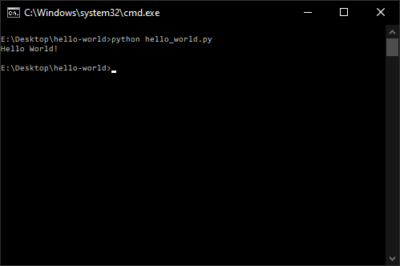

# hello-world

Hello World, the most magnificent piece of software of them all!

## Requirements
* Python 3 (tested on Python 3.8.3)

## Installation
* Clone this repository.
* With the repository as the working directory, enter the following into the shell: `python hello_world.py`